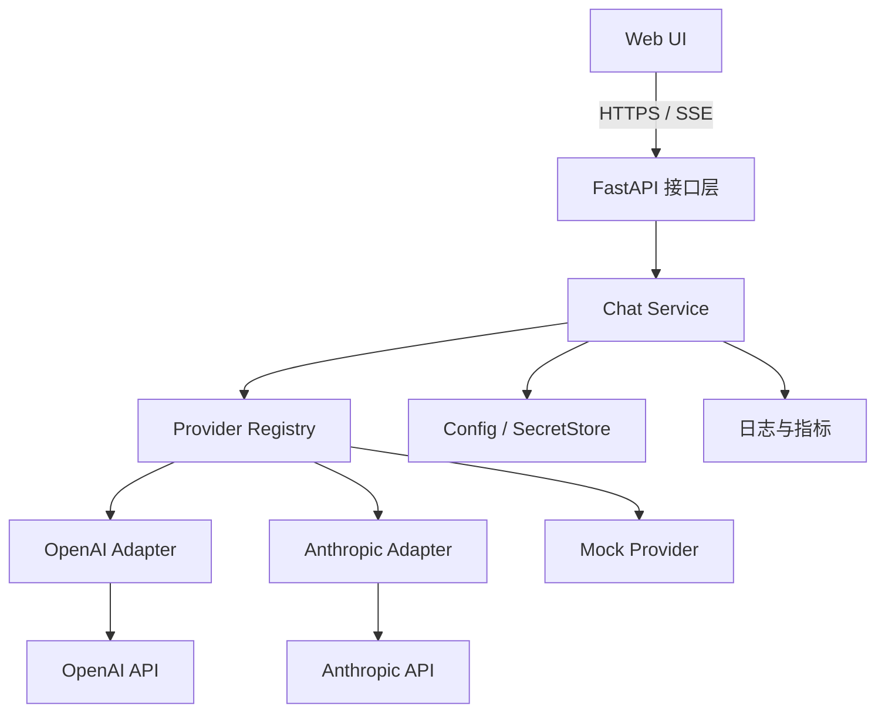

# 大模型 API 调用工具箱——系统设计文档

| 属性 | 内容 |
|---|---|
| 文档版本 | v2.0 |
| 文档状态 | 待评审 |
| 系统形态 | Web 应用，前后端分离 |
| 正式适配目标 | OpenAI API、Anthropic API |
| 辅助 Provider | Mock（开发与自动化测试）、DeepSeek（可选联调） |
| 目标读者 | 开发者、测试人员、课程验收/答辩评审人 |

## 1. 文档目的

本文档定义大模型 API 调用工具箱的需求边界、总体架构、模块职责、内部抽象、HTTP/SSE 接口、安全策略、测试方案和验收标准，并作为后续开发、测试和答辩的共同依据。

本文档描述“应当实现什么”和“各模块如何协作”，示例代码只表达接口语义，不代表最终实现。

## 2. 项目背景与目标

### 2.1 背景

OpenAI 与 Anthropic 的鉴权方式、请求字段、流式事件和响应结构并不完全相同。如果前端直接适配不同厂商，不仅会暴露 API 密钥，还会使界面逻辑与厂商协议强耦合。

本项目在后端增加统一网关，通过 Provider Adapter 将内部统一协议转换为各厂商协议，使前端只依赖本系统 API。

当前可能没有 OpenAI 或 Anthropic 的真实密钥，因此开发和验收分为两个层级：

1. **离线可验收**：依靠 Mock Provider 和厂商 Adapter 契约测试，验证完整前后端链路及协议转换。
2. **在线可验证**：获得真实密钥后运行对应 Provider 的 smoke test；也可使用兼容 OpenAI 协议的 DeepSeek 验证兼容适配器，但它不能替代 OpenAI 本身的在线验证。

“正式适配目标”不等于“当前已经在线验证”。项目状态必须使用以下三个术语准确表达：

- **已实现（implemented）**：Adapter 已完成，并通过离线契约测试。
- **已在线验证（live-verified）**：使用该厂商真实密钥完成最小 smoke test。
- **未执行在线验证（NOT_RUN）**：因无密钥、无额度或网络限制未执行；不等于测试失败。

### 2.2 核心目标

- 提供统一的网页聊天界面，可选择 Provider、模型和基础生成参数。
- 在服务端安全调用 OpenAI 与 Anthropic API，支持非流式和流式文本响应。
- 屏蔽不同厂商的协议差异，向前端暴露稳定、版本化的内部 API。
- 在没有任何真实密钥时，仍可启动系统、演示功能并运行自动化测试。
- 对鉴权失败、限流、超时、上游故障和用户取消等情况提供一致的错误体验。
- 通过配置和 Adapter 注册扩展新 Provider，不修改前端核心对话逻辑。

### 2.3 成功定义

项目达到以下状态即视为 MVP 成功：

1. 零密钥环境可以启动，Mock 对话及流式输出完整可用。
2. OpenAI 与 Anthropic Adapter 均通过离线契约测试。
3. 配置相应真实密钥后，无需改代码即可执行在线调用。
4. 密钥不进入浏览器、响应、日志或 Git 历史。
5. 本文第 13 节的 P0 验收项全部通过。

### 2.4 无真实密钥时的验收方案

OpenAI 和 Anthropic 的核心验收不依赖真实账号，具体采用四类离线证据：

1. **请求转换测试**：给 Adapter 输入固定 `ChatRequest`，拦截 SDK/HTTP 调用，断言目标 Provider 收到正确的 model、messages、system、temperature 和最大输出 token 字段。
2. **响应转换测试**：使用脱敏的固定 JSON fixture 模拟厂商响应，断言其被转换为统一 `ChatResponse`、usage 和 finish reason。
3. **流式契约测试**：按厂商官方事件顺序提供固定流事件，断言 Adapter 输出统一的 `delta`、`done` 或 `error`，且事件不丢失、不重复。
4. **故障契约测试**：模拟鉴权失败、429、5xx、超时和中途断流，断言统一错误码、是否重试及终止行为。

测试替身应放在 Provider SDK 或 HTTP 传输边界，而不是直接伪造 Adapter 的最终返回值。否则只能证明 Chat Service 能消费统一结果，不能证明 Adapter 的协议转换正确。

因此，无密钥时的完整作业验收主线为：

`Mock 前后端 E2E → OpenAI 离线契约 → Anthropic 离线契约 → 安全/错误/性能验收`

DeepSeek 在线联调属于额外证据；OpenAI/Anthropic 的真实 smoke test 属于有资源时再执行的条件项。

## 3. 范围与约束

### 3.1 MVP 范围

- 单用户或可信内网使用场景。
- 纯文本、多轮对话。
- OpenAI、Anthropic、Mock Provider。
- 可选的 OpenAI-Compatible Provider，用于 DeepSeek 等兼容服务。
- 基础参数：模型、system prompt、temperature、最大输出 token 数。
- 当前页面会话历史；刷新后是否保留不作为 P0 要求。
- 流式输出、停止生成、清空对话、复制回答。
- 健康检查、结构化日志、基础用量展示。

### 3.2 明确不在 MVP 范围

- 用户注册、登录、RBAC、多租户和按用户存储密钥。
- 服务端持久化聊天记录。
- 图片、音频、文件、多模态输入。
- Tool Calling、Web Search、RAG 和 Agent 工作流。
- 自动模型路由、负载均衡、跨 Provider 故障转移。
- 计费结算和精确成本核算。
- 生产级高可用、多实例部署和分布式限流。

以上能力可在架构稳定后增量加入，不应阻塞 MVP。

### 3.3 关键假设

- 后端运行在受信任环境，API 密钥由部署者配置。
- 前端只能访问本系统后端，不能直接访问厂商 API。
- Provider、base URL 与模型目录由服务端配置；普通用户不能提交任意 base URL，避免 SSRF。
- MVP 不保证不同模型对相同参数具有完全一致的语义，只保证字段校验、能力声明和可预测降级。

## 4. 架构决策

| 决策 | 选择 | 原因 |
|---|---|---|
| 部署架构 | 模块化单体 | 规模较小，易开发、测试和部署，同时保留清晰模块边界 |
| 前端 | Next.js + React + TypeScript | 适合交互式 Web UI，类型约束较强 |
| 后端 | FastAPI + Python | 异步流式支持良好，可自动生成 OpenAPI 文档 |
| UI | Tailwind CSS + Shadcn/UI | 快速构建一致且响应式的界面 |
| 厂商 SDK | 官方 OpenAI、Anthropic Python SDK | 减少底层协议与流式解析错误 |
| 内部扩展机制 | Provider Adapter + Registry | 隔离厂商差异，新增 Provider 的影响范围可控 |
| 流式协议 | 服务端发送事件 SSE；前端使用 `fetch` 读取流 | 支持 POST 请求体、取消请求和逐块渲染 |
| 密钥来源 | 环境变量实现 `SecretStore` | MVP 简单且密钥不进入浏览器；未来可替换为数据库/密钥服务 |
| 会话存储 | 前端内存 | 避免提前引入数据库和隐私治理 |
| API 版本 | `/api/v1` | 为未来不兼容变更保留升级路径 |

## 5. 总体架构



### 5.1 请求流程

1. 用户在前端选择 Provider、模型并发送消息。
2. 接口层解析和校验请求，生成 `request_id`。
3. Chat Service 检查 Provider 可用性、模型归属及参数范围。
4. Provider Registry 返回对应 Adapter。
5. Adapter 从 SecretStore 获取密钥并将统一请求转换为厂商请求。
6. Adapter 调用厂商 SDK，将响应或流事件转换为内部统一模型。
7. 接口层向前端返回 JSON，或持续发送统一 SSE 事件。
8. 日志模块记录请求元数据、耗时、状态与 token 用量，但默认不记录提示词、回答和密钥。

### 5.2 依赖方向

依赖只允许由外向内：

`API/UI → Application Service → Domain Contract ← Provider Adapter`

Chat Service 只依赖 `BaseProvider` 和 `SecretStore` 接口，不依赖具体 SDK。厂商对象、异常和流事件不得越过 Adapter 边界。

## 6. 模块设计

### 6.1 前端模块

| 模块 | 职责 |
|---|---|
| Provider/Model Selector | 获取可用 Provider 与模型；禁用未配置项并展示原因 |
| Parameter Panel | 编辑 system prompt、temperature、最大输出 token 数 |
| Conversation View | 展示 user/assistant 消息、流式增量和结束原因 |
| Request Controller | 发送请求、读取 SSE、处理取消、超时和错误 |
| Session State | 管理当前页面的消息、加载状态和最后一次请求信息 |

关键交互规则：

- Provider 改变时刷新模型列表，并自动选择该 Provider 的默认模型。
- 发送期间禁用重复提交，但保留“停止生成”按钮。
- 用户停止生成时调用 `AbortController.abort()`；已生成内容保留并标记为“已取消”。
- 流中出现 `error` 事件时结束加载状态，不把错误文本拼接为模型回答。
- 前端不缓存、不打印、不接收任何 Provider API key。

### 6.2 API 接口层

职责：

- HTTP 路由、请求反序列化和基础 schema 校验。
- 生成/透传 `request_id`。
- 将领域错误映射为 HTTP 状态码或 SSE `error` 事件。
- 设置 CORS、响应头和 SSE 禁缓存头。
- 监听客户端断开并向下游传播取消信号。

接口层不负责厂商协议转换，不直接读取环境变量。

### 6.3 Chat Service

职责：

- 编排一次聊天请求。
- 校验 Provider、模型和能力是否匹配。
- 应用超时、重试、并发限制和取消策略。
- 统一日志上下文和使用量统计。
- 调用 Provider 的非流式或流式方法。

### 6.4 Provider 接口

概念接口如下：

```python
class BaseProvider(Protocol):
    name: str

    async def get_status(self) -> ProviderStatus: ...
    async def list_models(self) -> list[ModelInfo]: ...
    async def chat(self, request: ChatRequest) -> ChatResult: ...
    def stream_chat(self, request: ChatRequest) -> AsyncIterator[ProviderEvent]: ...
```

约束：

- Adapter 必须将厂商异常映射为统一 `ProviderError`。
- Adapter 必须输出统一结束原因和统一 token 字段。
- Adapter 不得把 API key、原始响应头或未经筛选的上游错误返回给前端。
- Provider 不支持某参数时，应在请求前返回 `UNSUPPORTED_PARAMETER`，不得静默忽略影响明显的参数。
- 未配置密钥时，Provider 仍可被发现，但状态为 `unavailable`；系统启动不能因此失败。

### 6.5 Provider Registry 与模型目录

Registry 通过配置创建 Provider，不应在业务代码中散落判断：

```text
provider name -> adapter type + base_url + secret reference + model catalog
```

模型目录由服务端配置维护，前端不可任意组合 Provider 与模型。`ModelInfo` 至少包含：

- `id`：发送给上游的模型标识。
- `display_name`：界面显示名称。
- `provider`：所属 Provider。
- `capabilities`：如 `text`、`streaming`。
- `default_parameters` 与允许范围。

不在设计文档中硬编码会频繁变化的真实模型名称；具体名称放入配置及 `.env.example`/README 示例中。

### 6.6 厂商 Adapter

#### OpenAI Adapter

- 使用 OpenAI 官方 SDK。
- Adapter 内部选择并封装 OpenAI 当前推荐的文本生成接口；该选择不能影响本系统统一 API。
- 将 `system_prompt`、消息列表、最大输出 token 数和结束原因转换为内部模型。
- OpenAI-Compatible 是独立配置实例，可复用兼容协议代码，但必须允许其拥有独立 base URL、密钥、模型目录和错误映射。

#### Anthropic Adapter

- 使用 Anthropic 官方 SDK 和 Messages API。
- 将内部 `system_prompt` 映射为 Anthropic 顶层 `system` 参数。
- 仅把允许的 user/assistant 消息发送到 `messages`。
- 流式处理时只提取当前 MVP 需要的文本增量、结束原因、使用量和错误；对未知上游事件安全忽略并记录 debug 日志。

#### Mock Provider

- 不需要密钥或网络。
- 能稳定生成非流式和流式响应。
- 可通过测试配置模拟延迟、401、429、超时、5xx、中途断流和用户取消。
- 输出结构必须与真实 Provider 的统一结果一致。

### 6.7 SecretStore

```python
class SecretStore(Protocol):
    async def get_secret(self, provider: str) -> str | None: ...
```

MVP 实现为 `EnvSecretStore`。数据库实现只定义扩展点，不需要提供空壳类冒充已实现能力。

安全要求：

- `.env` 必须加入 `.gitignore`，仓库只提交 `.env.example`。
- 禁止在日志、异常、监控标签、API 响应和前端状态中写入密钥。
- 日志若必须识别凭据，只记录不可逆指纹，不记录首尾字符。
- 生产环境优先使用部署平台 Secret 或专用密钥服务，而非普通配置文件。

### 6.8 可观测性

每次请求至少记录：

- `request_id`、provider、model。
- 是否流式、开始时间、总耗时、TTFT。
- 结果状态、统一错误码、重试次数。
- input/output token（上游提供时）。
- 客户端取消标记。

默认不记录 prompt、completion 和完整上游响应。日志采用 JSON 结构，便于检索；密钥、Authorization header 和 Cookie 必须统一脱敏。

## 7. 统一数据模型

### 7.1 ChatRequest

```json
{
  "provider": "anthropic",
  "model": "configured-model-id",
  "messages": [
    {"role": "user", "content": "你好，请用一句话介绍你自己。"}
  ],
  "system_prompt": "你是一个简洁、可靠的助手。",
  "parameters": {
    "temperature": 0.7,
    "max_output_tokens": 1024
  }
}
```

字段约束：

| 字段 | 类型 | 必填 | 约束 |
|---|---|---:|---|
| provider | string | 是 | 必须存在于 Registry |
| model | string | 是 | 必须属于所选 Provider 且已启用 |
| messages | array | 是 | 1–50 条；MVP 只接受 user/assistant；最后一条必须为 user |
| messages[].content | string | 是 | 非空；单条和总长度受服务端配置限制 |
| system_prompt | string/null | 否 | 默认空；长度受限 |
| parameters.temperature | number/null | 否 | 建议 0–2；最终范围由模型目录约束 |
| parameters.max_output_tokens | integer | 否 | 正整数，不得超过模型及系统上限 |

不在请求体中放置 `stream` 字段：流式和非流式由不同端点表达，避免同一路由出现两种不易描述的响应类型。

### 7.2 ChatResponse

```json
{
  "request_id": "req_01...",
  "data": {
    "output_text": "你好，我是一个由大模型驱动的助手。",
    "provider": "anthropic",
    "model": "actual-upstream-model-id",
    "finish_reason": "stop",
    "usage": {
      "input_tokens": 20,
      "output_tokens": 16,
      "total_tokens": 36
    }
  }
}
```

统一 `finish_reason`：`stop`、`length`、`content_filter`、`tool_call`、`cancelled`、`unknown`。MVP 不执行工具，但保留 `tool_call` 映射，前端可提示“当前版本不支持工具调用”。

若上游不提供某个 usage 字段，该字段返回 `null`，不得伪造为 0。

### 7.3 ErrorResponse

```json
{
  "request_id": "req_01...",
  "error": {
    "code": "PROVIDER_AUTH_FAILED",
    "message": "Provider authentication failed.",
    "provider": "anthropic",
    "retryable": false
  }
}
```

响应不得包含堆栈、SDK 异常对象、上游完整响应或密钥信息。

## 8. HTTP API 设计

### 8.1 端点列表

| 方法 | 路径 | 功能 | 成功响应 |
|---|---|---|---|
| POST | `/api/v1/chat/completions` | 非流式生成 | `200 application/json` |
| POST | `/api/v1/chat/completions/stream` | 流式生成 | `200 text/event-stream` |
| GET | `/api/v1/providers` | Provider 状态与能力 | `200 application/json` |
| GET | `/api/v1/models?provider=...` | 指定 Provider 的已配置模型 | `200 application/json` |
| GET | `/api/v1/health/live` | 进程存活检查 | `200` |
| GET | `/api/v1/health/ready` | 配置与核心依赖就绪检查 | `200` 或 `503` |

`live` 不访问外部 Provider；`ready` 只验证本地必要配置与组件，不应因为某个可选 Provider 无密钥而使整个应用不可用。

### 8.2 Provider 状态响应

```json
{
  "providers": [
    {
      "name": "mock",
      "display_name": "Mock",
      "status": "available",
      "reason_code": null,
      "capabilities": ["text", "streaming"]
    },
    {
      "name": "openai",
      "display_name": "OpenAI",
      "status": "unavailable",
      "reason_code": "NOT_CONFIGURED",
      "capabilities": ["text", "streaming"]
    }
  ]
}
```

接口只返回稳定的 `reason_code`；面向用户的中文/英文提示由前端本地化，不依赖后端错误字符串。

### 8.3 HTTP 错误映射

| HTTP | 统一错误码 | 是否重试 | 场景 |
|---:|---|---:|---|
| 400 | `INVALID_REQUEST` | 否 | JSON 合法但业务字段不满足约束 |
| 404 | `PROVIDER_NOT_FOUND` / `MODEL_NOT_FOUND` | 否 | Provider 或模型不存在 |
| 409 | `MODEL_PROVIDER_MISMATCH` | 否 | 模型不属于所选 Provider |
| 422 | `VALIDATION_ERROR` | 否 | schema/类型校验失败 |
| 429 | `RATE_LIMITED` | 是 | 本系统或上游限流 |
| 499* | `CLIENT_CANCELLED` | 否 | 仅内部日志使用；实际可能表现为连接关闭 |
| 502 | `PROVIDER_UPSTREAM_ERROR` | 视情况 | 上游错误或非法响应 |
| 503 | `PROVIDER_NOT_CONFIGURED` / `PROVIDER_UNAVAILABLE` | 否/是 | 密钥缺失或上游暂不可用 |
| 504 | `PROVIDER_TIMEOUT` | 是 | 上游超时 |

鉴权失败对本系统调用者返回 `502 PROVIDER_AUTH_FAILED`，避免将上游 401 误解为用户未登录本系统。

## 9. SSE 流式协议

前端通过 `fetch()` POST 到流式端点并读取 response body。原生 `EventSource` 仅适合 GET，不能直接携带本项目的 JSON 请求体。

响应头至少包含：

```text
Content-Type: text/event-stream; charset=utf-8
Cache-Control: no-cache, no-transform
X-Accel-Buffering: no
```

### 9.1 事件序列

```text
event: meta
data: {"request_id":"req_01...","provider":"openai","model":"actual-model","seq":0}

event: delta
data: {"delta":"你","seq":1}

event: delta
data: {"delta":"好","seq":2}

event: done
data: {"finish_reason":"stop","usage":{"input_tokens":20,"output_tokens":2,"total_tokens":22},"seq":3}
```

失败事件：

```text
event: error
data: {"error":{"code":"PROVIDER_TIMEOUT","message":"Provider request timed out.","retryable":true},"seq":2}
```

协议规则：

- 正常顺序为 `meta → delta* → done`。
- `done` 与 `error` 都是终止事件，二者只能出现一个。
- 每个事件以空行结束；`data` 必须是单行 JSON。
- `seq` 单调递增，便于测试事件顺序和定位丢帧。
- 连接空闲时可每 15 秒发送 SSE 注释作为 keepalive。
- HTTP 响应头发出前的错误使用普通 HTTP ErrorResponse；流已经开始后的错误必须使用 SSE `error` 事件。
- 一旦向客户端发送过内容，不得自动重试并重放整段响应，否则可能产生重复文本与重复计费。
- 客户端必须忽略未知事件类型，以兼容未来扩展。

## 10. 可靠性策略

### 10.1 超时

建议默认值，可通过配置调整：

- 连接超时：10 秒。
- 首事件超时：30 秒。
- 流空闲超时：30 秒。
- 单请求总时限：60 秒；长输出模型可按模型配置覆盖。

### 10.2 重试

- `401/403`、参数错误和内容策略拒绝：不重试。
- `429`：优先遵循 `Retry-After`，否则采用带随机抖动的指数退避。
- 网络连接失败、部分 `5xx`：最多重试 2 次。
- 非流式请求只有在明确为可重试错误时重试。
- 流式请求只允许在尚未向客户端发送 `delta` 前重试；发送首个 `delta` 后禁止透明重试。
- 每次重试共享同一总超时预算并记录 `retry_count`。

### 10.3 并发、背压与取消

- 后端设置全局和每 Provider 并发上限，超过上限返回 429 或短暂排队。
- SSE 写入必须等待客户端消费，避免无限缓存。
- 检测客户端断开后，应尽快取消上游调用并释放连接。
- 前端同一会话一次只允许一个进行中的生成请求。

## 11. 安全与隐私

### 11.1 密钥安全

- 密钥只存在于后端运行环境。
- 浏览器 Network、HTML、JavaScript bundle、Local Storage 与接口响应中不得出现密钥。
- `.env`、本地密钥文件和日志文件不得提交 Git。
- CI 运行 secret scanning；提交前检查当前文件及 Git 历史。

### 11.2 输入与接口安全

- 限制消息数量、单条长度、总字符数和最大输出 token。
- Provider、模型、base URL 使用服务端 allowlist。
- 生产环境只允许 HTTPS 上游地址。
- CORS 使用明确 origin allowlist，不使用带凭据的通配符。
- 对外部署时必须在本系统前增加身份认证和用户级限流；这属于生产化前置条件。

### 11.3 隐私

- 默认不持久化对话，不记录正文。
- 若未来增加历史记录，必须另行定义保存期限、删除机制、访问控制和敏感信息处理规则。
- UI 应提示用户：输入内容会发送给所选第三方 Provider，并受其数据政策约束。

## 12. 测试策略

### 12.1 测试分层

| 层级 | 目标 | 是否需要真实密钥 |
|---|---|---:|
| 单元测试 | 参数校验、错误映射、Registry、SecretStore | 否 |
| Adapter 契约测试 | 固定上游请求/响应，验证双向转换与流事件归一化 | 否 |
| API 集成测试 | FastAPI + Mock，验证 HTTP/SSE、取消、超时 | 否 |
| 前端组件测试 | 选择器、消息渲染、错误状态、停止生成 | 否 |
| E2E 测试 | 浏览器完成 Mock 对话与异常场景 | 否 |
| Provider smoke test | 对真实 OpenAI/Anthropic 发起最小调用 | 是；条件执行 |
| 兼容联调 | 使用 DeepSeek 验证 OpenAI-Compatible 通路 | 可选 |

### 12.2 必测异常场景

- Provider 未配置、密钥错误、模型不存在、模型与 Provider 不匹配。
- 429、5xx、连接超时、首事件超时、流中途报错。
- 空消息、超长消息、非法 role、越界参数。
- 用户在首 token 前取消、生成中取消、客户端直接断开。
- 未知上游流事件和 usage 缺失。
- 日志及响应中无 Authorization/header/secret 泄露。

### 12.3 在线支持的声明规则

- Adapter 契约测试通过：可声明“已实现该 Provider 适配”。
- 真实 smoke test 通过：才可声明“已完成该 Provider 在线验证”。
- DeepSeek 成功只能证明 OpenAI-Compatible 通路可工作，不能替代 OpenAI 在线验证。

## 13. 验收标准

### 13.1 P0 功能验收（必须全部通过）

| ID | 验收项 | 前置条件 | 操作与预期结果 |
|---|---|---|---|
| F-01 | 零密钥启动 | 所有真实 key 为空 | 前后端成功启动；`health/live` 和 `health/ready` 返回 200；Mock 可用 |
| F-02 | Mock 非流式 | 无 | 发送合法请求，返回统一 ChatResponse、`request_id` 和 usage |
| F-03 | Mock 流式 | 无 | 收到 `meta → delta+ → done`；页面逐步渲染且最终文本正确 |
| F-04 | Provider 状态 | OpenAI/Anthropic key 为空 | 两者显示 unavailable/NOT_CONFIGURED，Mock 显示 available |
| F-05 | 未配置调用 | key 为空 | 调用真实 Provider 得到 503 + `PROVIDER_NOT_CONFIGURED`，系统不崩溃 |
| F-06 | 模型约束 | 无 | Provider 与模型不匹配时得到 409，未向上游发请求 |
| F-07 | OpenAI 契约 | 固定 SDK stub | 请求映射、文本响应、usage、finish reason、流事件均通过测试 |
| F-08 | Anthropic 契约 | 固定 SDK stub | 顶层 system、messages、usage、finish reason、流事件均通过测试 |
| F-09 | 错误归一化 | Mock 故障注入 | 401/429/超时/5xx 映射为规定错误码和 retryable 值 |
| F-10 | 停止生成 | Mock 流式请求进行中 | 点击停止后 1 秒内 UI 停止追加，后端观察到取消并释放任务 |
| F-11 | 密钥安全 | 配置测试密钥 | 浏览器、API 响应、应用日志和仓库当前内容均找不到明文密钥 |
| F-12 | API 文档 | 后端启动 | `/docs` 可访问；所有端点具有 schema、状态码和示例 |

### 13.2 条件性在线验证（有密钥时执行，不作为 P0 通过门槛）

| ID | Provider | 验收标准 |
|---|---|---|
| O-01 | OpenAI | 非流式最小请求成功；返回文本、实际模型、结束原因和可用的 usage |
| O-02 | OpenAI | 流式请求至少收到一个 delta 和一个终止事件；停止生成有效 |
| O-03 | Anthropic | 非流式最小请求成功；system prompt 与消息顺序正确生效 |
| O-04 | Anthropic | 流式请求至少收到一个 delta 和一个终止事件；停止生成有效 |
| O-05 | DeepSeek（可选） | OpenAI-Compatible 配置无需修改业务代码即可完成非流式和流式调用 |

如果缺少真实密钥，本节项目标记为 `NOT_RUN`，不能标记为通过，但不阻塞项目 P0 验收。最终结论应写成“OpenAI/Anthropic Adapter 已实现并通过离线契约测试，真实在线验证因缺少密钥未执行”，不能写成“已完成真实 API 验证”。

### 13.3 性能与稳定性验收

性能硬指标只对可控的本地 Mock 环境设置；真实 Provider 受公网、排队和模型生成速度影响，只记录基线，不设不合理的固定通过线。

| ID | 指标 | 门槛 | 测量方法 |
|---|---|---:|---|
| P-01 | Mock 非流式 API 延迟 | P95 < 800 ms | 预热后 200 次请求，固定 Mock 延迟配置 |
| P-02 | Mock 流式首事件时间 | P95 < 500 ms | 从请求发出到收到 `meta`/首 `delta` |
| P-03 | 10 并发稳定性 | 100 次请求成功率 ≥ 99% | 并发度 10；无故障注入 |
| P-04 | 流事件完整性 | 100/100 无乱序、无重复终止 | 校验 `seq` 与事件状态机 |
| P-05 | 取消释放时间 | P95 < 1 s | 生成中取消 50 次，检查服务端任务结束 |
| P-06 | 前端首屏 | Lighthouse 本地生产构建 Performance ≥ 80 | 固定浏览器与机器记录环境 |

真实 Provider 记录 TTFT、总耗时和错误率，测试报告需注明 Provider、模型、地区、网络、时间与样本数。

### 13.4 质量验收

- 后端核心模块语句覆盖率 ≥ 80%；项目总体覆盖率 ≥ 70%。
- 所有 P0 自动化测试通过，无跳过的关键测试。
- lint、类型检查和构建全部通过。
- 新增一个 Mock 类型的示例 Provider，只需新增 Adapter、配置与注册，不修改 Chat Service 和前端对话主流程。
- README 可使新开发者在 15 分钟内完成零密钥启动。
- OpenAPI 文档、README、`.env.example` 与实现字段一致。

### 13.5 安全验收清单

- [ ] `.env` 和本地密钥文件已被 `.gitignore` 排除。
- [ ] 前端构建产物中不存在 Provider API key。
- [ ] 浏览器 Network 面板中不存在 Provider API key。
- [ ] 正常日志和异常日志中不存在 Provider API key、Authorization header、prompt 和 completion 正文。
- [ ] 请求不能指定任意 base URL。
- [ ] CORS 仅允许配置的前端 origin。
- [ ] 超长输入、非法模型和越界参数在访问上游前被拒绝。
- [ ] 对外部署说明明确要求增加认证与限流。

## 14. 配置设计

`.env.example` 只展示变量名和安全默认值：

```dotenv
APP_ENV=development
LOG_LEVEL=INFO
ALLOWED_ORIGINS=http://localhost:3000

OPENAI_API_KEY=
ANTHROPIC_API_KEY=
DEEPSEEK_API_KEY=

DEFAULT_PROVIDER=mock
REQUEST_TOTAL_TIMEOUT_SECONDS=60
MAX_CONCURRENT_REQUESTS=20
```

Provider 的 base URL 不由普通前端请求传入。若允许部署者配置自定义兼容服务，启动时必须校验 URL scheme 和 host allowlist。

## 15. 推荐目录结构

```text
project/
├── frontend/
│   ├── app/
│   ├── components/
│   ├── lib/api/
│   └── tests/
├── backend/
│   ├── app/api/v1/
│   ├── app/application/
│   ├── app/domain/
│   ├── app/providers/
│   ├── app/config/
│   ├── app/observability/
│   └── tests/
├── .env.example
├── README.md
├── ARCHITECTURE.md
└── ACCEPTANCE.md
```

目录表达依赖边界，不要求为每个概念机械创建文件。

## 16. 分阶段实施计划

| 阶段 | 目标 | 主要交付物 | 退出条件 |
|---|---|---|---|
| 1. 协议与骨架 | 固化统一模型和错误码 | API schema、Provider 接口、配置骨架 | schema 与本文一致，应用零密钥启动 |
| 2. Mock 纵向链路 | 跑通 UI→API→Provider→SSE | 基础页面、Mock、停止生成 | F-01 至 F-05、F-10 通过 |
| 3. 厂商适配 | 完成 OpenAI/Anthropic Adapter | 两个 Adapter 与契约测试 | F-06 至 F-09 通过 |
| 4. 安全与可靠性 | 补齐限制、超时、重试、日志 | 安全中间件、故障注入测试 | F-11、安全清单通过 |
| 5. 验收与文档 | 建立可复现交付 | README、OpenAPI、测试报告 | 全部 P0、性能与质量门槛通过 |
| 6. 在线验证 | 验证真实 Provider | 条件 smoke test 报告 | 有密钥项通过；无密钥项记 NOT_RUN |

## 17. 交付物

- 前端与后端源代码。
- `README.md`：环境要求、零密钥启动、配置真实 Provider、常见错误。
- `.env.example`：不含真实密钥的配置模板。
- 自动化测试：单元、契约、API 集成、前端/E2E。
- OpenAPI 文档及接口示例。
- `ACCEPTANCE.md`：从本文第 13 节提取的可执行验收清单。
- 测试报告：环境、命令、样本数、结果与未执行项。
- 可选 Dockerfile/Compose，用于统一运行环境。

## 18. 风险与应对

| 风险 | 影响 | 应对 |
|---|---|---|
| 无真实 OpenAI/Anthropic 密钥 | 无法完成在线验证 | 离线契约测试保证实现质量；在线项明确标记 NOT_RUN |
| 厂商模型和字段变化 | 硬编码失效 | 模型目录配置化；Adapter 隔离；依赖版本锁定与定期 smoke test |
| SSE 被代理缓冲 | 前端看似非流式 | 设置禁缓冲头；部署文档注明代理配置；E2E 检查逐事件到达 |
| 流式重试产生重复内容/计费 | 错误回答与额外成本 | 首个 delta 后禁止透明重试 |
| 日志泄露隐私或密钥 | 严重安全问题 | 默认不记录正文；统一脱敏；secret scanning |
| 统一接口抹平厂商能力 | 新能力难表达 | MVP 只统一共同文本能力；通过 capability 声明渐进扩展 |

## 19. 后续扩展

优先级建议：

1. 身份认证、用户级限流和审计。
2. 服务端会话与消息持久化。
3. Token 成本估算和预算控制。
4. 工具调用和结构化输出。
5. 多模态输入。
6. 多模型并排比较。
7. 数据库或专用密钥服务实现 SecretStore。

## 20. 设计说明：为什么这样设计

### 20.1 为什么选择模块化单体，而不是微服务

当前系统只有一个核心业务：把统一聊天请求路由到不同大模型 Provider。拆成多个微服务会引入服务发现、部署、网络错误和分布式日志等额外成本，却没有相应业务收益。模块化单体足以体现清晰的架构边界，并且未来可以按模块拆分。

### 20.2 为什么同时需要 Provider Adapter 和 Chat Service

Adapter 解决“协议不同”：字段、SDK、流事件、错误和 token 用量如何转换。Chat Service 解决“业务流程相同”：校验、超时、重试、取消、日志和路由。两者分开后，新增厂商不需要复制通用可靠性逻辑。

### 20.3 为什么不让前端直接调用厂商

浏览器无法安全保存长期 API key；任何打包进前端或由前端携带的共享密钥都能被用户看到。后端代理还提供统一协议、输入限制、错误处理和审计能力。

### 20.4 为什么把流式和非流式拆成两个端点

两种响应的媒体类型和生命周期完全不同。拆分后 OpenAPI 更清晰，前端状态机更简单，也避免请求体 `stream` 与路由行为冲突。两条路由仍复用同一个 Chat Service。

### 20.5 为什么不能用 DeepSeek 完全替代 OpenAI 验收

兼容 OpenAI 协议只说明请求外形相近，不保证所有字段、错误、流事件和 SDK 行为完全一致。因此 DeepSeek 很适合低成本联调兼容层，但 OpenAI Adapter 是否真正在线可用仍需 OpenAI smoke test 证明。

### 20.6 为什么公网 TTFT 不作为硬性验收线

真实模型的首 token 时间同时受到模型负载、地区、网络和输出任务影响，不完全由本系统控制。硬性规定“必须小于 2 秒”可能让正确实现因公网波动失败。更合理的方式是对 Mock 设置硬指标，对真实 Provider 记录可比较的测试基线。

### 20.7 为什么流开始后不自动重试

流式响应一旦已经显示部分文本，重新调用可能让前端收到重复内容，也可能造成第二次计费。只有在尚未输出任何 delta 时，透明重试才相对安全。

### 20.8 为什么模型列表采用配置，而不是永久硬编码

模型名称、可用区域和生命周期会变化。配置化目录让模型更新不侵入业务逻辑，同时还能约束 Provider 与模型的合法组合。若以后需要动态拉取上游模型列表，可以在不改变前端协议的情况下替换目录来源。

## 21. 参考资料

- [OpenAI API Documentation](https://platform.openai.com/docs/)
- [OpenAI API Reference](https://platform.openai.com/docs/api-reference/)
- [Anthropic Messages API](https://platform.claude.com/docs/en/api/messages)
- [Anthropic Streaming Messages](https://platform.claude.com/docs/en/build-with-claude/streaming)
- [DeepSeek API Documentation](https://api-docs.deepseek.com/)
- [MDN: Using server-sent events](https://developer.mozilla.org/docs/Web/API/Server-sent_events/Using_server-sent_events)
