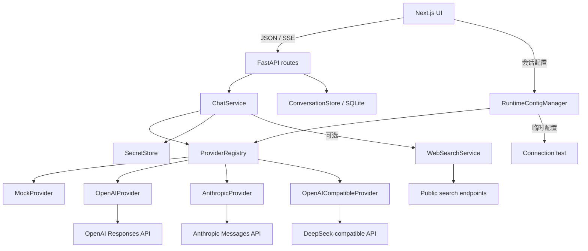

# Architecture

## 1. Context

LLM API Toolbox is a local-only modular monolith. The browser never calls a model vendor directly. It sends one stable request shape to FastAPI, and the backend routes it through a Provider adapter.

## 2. Dependency rules

- `app/api.py` handles HTTP/SSE only.
- `ChatService` owns validation, concurrency, total timeout and retries.
- `ProviderRegistry` owns provider discovery and model/provider matching.
- Provider adapters own vendor SDK calls and normalization.
- `SecretStore` owns secret lookup; providers do not read environment variables directly.
- Vendor SDK objects and raw exceptions do not cross the adapter boundary.
- The frontend depends only on `/api/v1`, never on a vendor schema.
- `ConversationStore` owns local SQLite history; the chat adapters never access it directly.

## 3. Request lifecycle

### Non-streaming

1. Middleware assigns a `request_id`.
2. Pydantic validates the JSON schema.
3. `ChatService.prepare()` validates system limits, provider and model.
4. The registry returns the adapter and checks availability.
5. `ChatService.chat()` acquires the concurrency semaphore and timeout budget.
6. Retryable failures may be retried within the same total timeout.
7. The adapter converts the vendor response to `ChatResult`.
8. FastAPI returns `ChatResponse` and `X-Request-ID`.

### Streaming

1. Validation and availability checks happen before response headers are sent.
2. The API emits `meta`.
3. Provider text becomes ordered `delta` events.
4. Usage and finish reason become one `done` event.
5. A post-header failure becomes one `error` event.
6. After the first delta, the service never retries automatically.
7. Client disconnect/cancellation closes the generator and upstream request.

## 4. Unified contracts

The request uses `provider`, `model`, `messages`, optional `system_prompt`, and a nested `parameters` object. Streaming and non-streaming use separate routes so each endpoint has one response type.

Finish reasons are normalized to:

- `stop`
- `length`
- `content_filter`
- `tool_call`
- `cancelled`
- `unknown`

Usage fields are nullable. A missing vendor count is represented as `null`, not a fabricated zero.

## 5. Provider status

Providers are registered even when their key is absent. Discovery therefore distinguishes:

- `available`: a key is configured, or none is required.
- `unavailable / NOT_CONFIGURED`: the adapter exists but cannot make a live call.

Missing optional providers do not make `/health/ready` fail. The application is ready when the required local Mock path is ready.

## 6. Retry boundary

- Authentication and invalid-request failures never retry.
- Rate limits, timeouts and transient upstream failures may retry.
- The maximum retry count and total timeout are configured independently.
- A stream may retry only before emitting the first `delta`.
- Every retry remains inside the original request's total timeout budget.

## 7. Security boundary

- Only the backend `RuntimeConfigManager` and `EnvSecretStore` receive provider keys.
- API responses and frontend types have no secret field.
- Runtime configuration accepts only known providers. Remote Base URLs must use HTTPS; localhost HTTP is allowed for local gateways.
- CORS is an explicit origin list.
- Logs contain metadata, duration and status but not prompt/completion bodies.
- The current deployment model is localhost. Public deployment requires authentication and user-level rate limiting.

## 8. Runtime provider configuration

- `GET /api/v1/settings/providers` returns status, Base URL and models, but never key values or key fragments.
- `PUT /api/v1/settings/providers/{provider}` replaces the selected provider configuration in backend memory.
- `POST /api/v1/settings/providers/{provider}/test` builds an isolated temporary adapter from the current form and tests one model without mutating runtime configuration.
- A registry and chat service are rebuilt, then swapped atomically; in-flight requests may finish with their original configuration.
- A blank `api_key` preserves the existing key; `clear_api_key=true` explicitly removes it.
- Runtime values disappear when the backend stops. `.env` remains the persistent configuration source.
- Test requests never persist their temporary key, Base URL or model and never create conversation history.

## 9. Adding a provider

1. Implement the `BaseProvider` protocol.
2. Normalize text, usage, finish reason and exceptions.
3. Add models and secret references to settings.
4. Register the provider in `dependencies.py`.
5. Add request, response, stream and error contract tests.

No change should be needed in `ChatService`, HTTP routes or the frontend conversation flow.

## 10. Conversation history

- The browser creates a conversation before the first model request and appends normalized user/assistant messages through `/api/v1/conversations`.
- SQLite uses foreign keys and cascade deletion so a conversation and its messages remain consistent.
- The first user message becomes a deterministic local title; no model request or extra API cost is required.
- Search covers both titles and message content. History is ordered by the latest update and grouped by time in the UI.
- Provider, model, system prompt and generation parameters are updated before subsequent requests and restored when a conversation is reopened.
- API keys are never written to the conversation database.

## 11. Frontend compatibility and viewport

- `/api/v1/meta` exposes an explicit compatibility version. The frontend blocks chat and displays a restart instruction when an older backend is detected.
- Provider configuration dialogs open before network loading begins, so offline or incompatible backends produce visible dialog states.
- The application root is locked to `100dvh`. History and messages are independent scroll containers; the composer remains in the workspace grid footer.
- Provider and model selectors remain in the header. “管理模型” opens the current Provider in new or existing conversations; saving preserves the selected model unless it was removed.

## 12. Experimental web search

- `ChatParameters.web_search_enabled` controls search augmentation for each request.
- When enabled, `ChatService.prepare()` searches the final user message before the provider call.
- `WebSearchService` tries Bing RSS first and DuckDuckGo HTML as a fallback; neither requires a separate API key.
- At most the configured number of titles, snippets and source URLs are appended to the system prompt.
- Search material is explicitly marked as untrusted and cannot replace system instructions.
- The service does not fetch arbitrary result pages. Failure produces `WEB_SEARCH_FAILED` instead of silently falling back.
- The switch is persisted per conversation. Startup automatically adds the database column for V1.4 histories.
